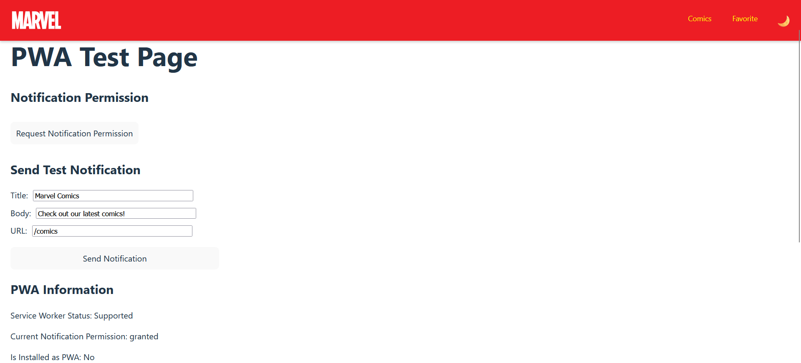

# Marvel Comics - Progressive Web App (PWA)

## Реализованные функции

- Возможность установки приложения на устройство (Web App Manifest)
- Работа в офлайн-режиме (кэширование через Service Worker)
- Push-уведомления (Web Push API)

## Запуск приложения

### 1. Запуск сервера уведомлений:
```
cd server
npm install
npm run dev
```

### 2. Запуск основного приложения (в отдельном терминале):
```
npm install
npm run dev
```

### 3. Откройте приложение в браузере (рекомендуется Chrome для полной поддержки PWA)

## Тестирование функций PWA

### Установка приложения
- В Chrome найдите иконку установки в адресной строке
- На мобильных устройствах появится предложение добавить на главный экран

### Push-уведомления
- Перейдите на страницу тестирования (/test)
- Нажмите "Request Notification Permission"
- После предоставления разрешения вы сможете отправлять тестовые уведомления

### Подробное тестирование push-уведомлений

1. Убедитесь, что оба сервера запущены (сервер уведомлений и основное приложение)
2. Откройте тестовую страницу по адресу `/test`
3. В разделе "Server Status" должен отображаться статус "Available" (зеленым цветом)
4. Нажмите кнопку "Request Notification Permission" и разрешите уведомления в браузере
5. В разделе "Send Test Notification" вы можете настроить:
   - Title: заголовок уведомления
   - Body: текст уведомления
   - URL: куда будет перенаправлен пользователь при клике на уведомление
6. Нажмите кнопку "Send Notification" для отправки тестового уведомления
7. Вы должны увидеть уведомление даже если приложение находится в фоновом режиме
8. При клике на уведомление, вы будете перенаправлены на указанный URL внутри приложения




### Офлайн-режим
- Откройте приложение при подключении к интернету
- После установки service worker можно отключить интернет
- При обновлении страницы приложение продолжит работать с кэшированными ресурсами

## Устранение проблем

Если у вас возникают ошибки с push-уведомлениями:
- Убедитесь, что сервер уведомлений запущен на порту 3000
- Проверьте статус сервера: `node server/test-server.js`
- Убедитесь, что разрешения на уведомления предоставлены в браузере
- Если сервер не запускается, проверьте, не занят ли порт 3000 другим приложением

## Техническая реализация

### Manifest
Файл `public/manifest.json` содержит метаданные для установки приложения.

### Service Worker
Файл `public/service-worker.js` обеспечивает:
- Кэширование ресурсов для работы офлайн
- Обработку push-уведомлений
- Перенаправление пользователя при клике на уведомление

### Push-уведомления
Реализация использует:
- Web Push API с VAPID-ключами
- Express-сервер для отправки уведомлений
- Клиентскую подписку на уведомления 