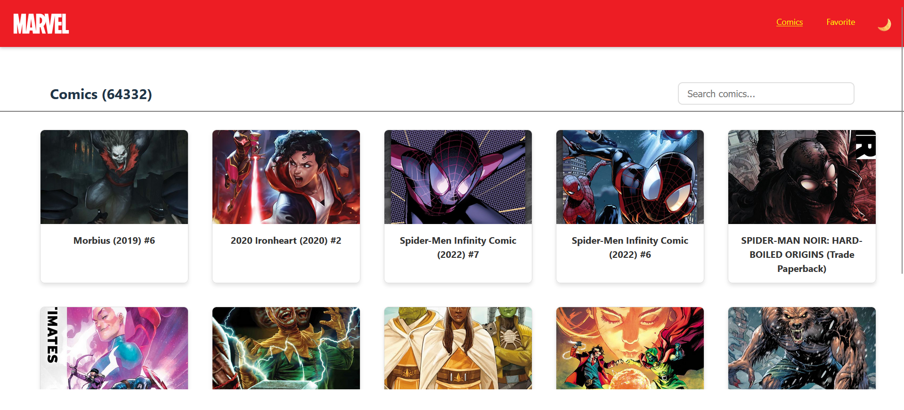
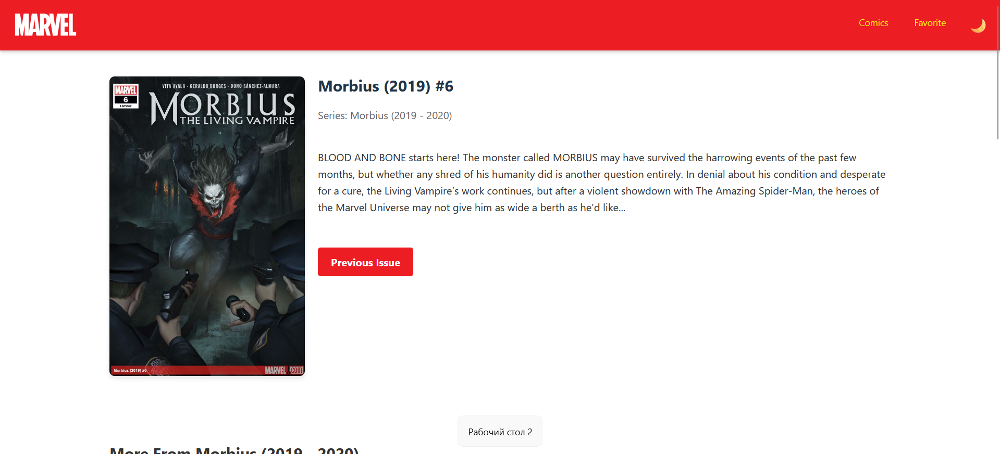
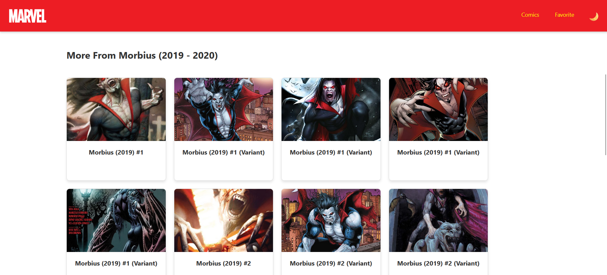
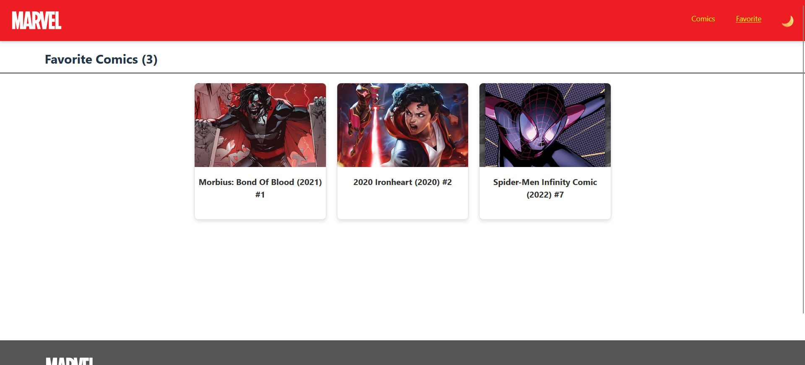

# Marvel Comics App

## О приложении

Marvel Comics App - это веб-приложение для просмотра комиксов Marvel, разработанное с использованием стека технологий React + TypeScript. Приложение предоставляет удобный интерфейс для просмотра, поиска и сохранения любимых комиксов Marvel.

### Основные технологии

- React 19.0
- TypeScript
- Vite
- MobX (для управления состоянием)
- React Router DOM (для маршрутизации)
- Axios (для HTTP-запросов)
- React Virtuoso (для оптимизированной прокрутки)

## Запуск приложения

### Предварительные требования

1. Node.js (последняя стабильная версия)
2. npm или yarn
3. Учетная запись разработчика Marvel API (для получения ключей API)

### Настройка окружения

1. Клонируйте репозиторий
2. Создайте файл `.env` в корневой директории проекта со следующими переменными:
```env
VITE_MARVEL_API_PUBLIC_KEY=ваш_публичный_ключ
VITE_MARVEL_API_PRIVATE_KEY=ваш_приватный_ключ
VITE_MARVEL_API_BASE_URL=https://gateway.marvel.com/v1/public
```

### Установка и запуск

1. Установите зависимости:
```bash
npm install
```

2. Запустите приложение в режиме разработки:
```bash
npm run dev
```

3. Для сборки проекта:
```bash
npm run build
```

## Поддерживаемые возможности

### 1. Просмотр комиксов
- Бесконечная прокрутка списка комиксов
- Оптимизированная загрузка изображений
- Адаптивный дизайн для различных устройств

### 2. Поиск
- Поиск комиксов по названию
- Автоматическое обновление результатов
- Дебаунсинг поисковых запросов

### 3. Детальная информация
- Подробное описание каждого комикса
- Просмотр вариантов обложек
- Навигация по серии комиксов
- Связанные комиксы

### 4. Избранное
- Добавление комиксов в избранное
- Локальное хранение списка избранного
- Быстрый доступ к сохраненным комиксам

### 5. Интерфейс
- Темная и светлая темы
- Адаптивный дизайн
- Анимации и переходы
- Информативные уведомления

### 6. Производительность
- Виртуализация списков
- Кеширование запросов
- Оптимизированная загрузка изображений
- Ленивая загрузка компонентов

## Скриншоты

### Главная страница


### Детальная страница комикса



### Страница избранного


## Дополнительная информация

Приложение использует официальное API Marvel Comics. Для работы с приложением необходимо получить API ключи на сайте [developer.marvel.com](https://developer.marvel.com/).

© 2025 MARVEL. Все права защищены.